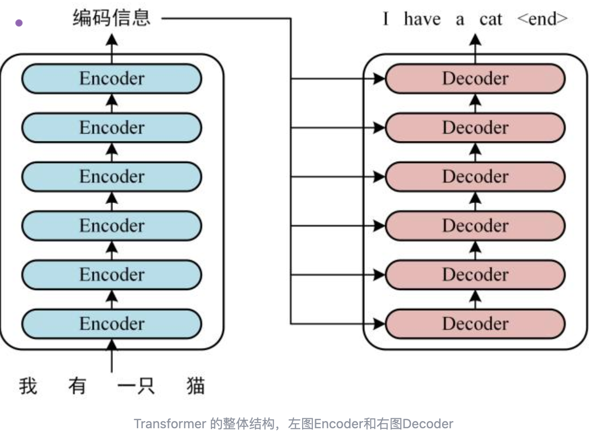
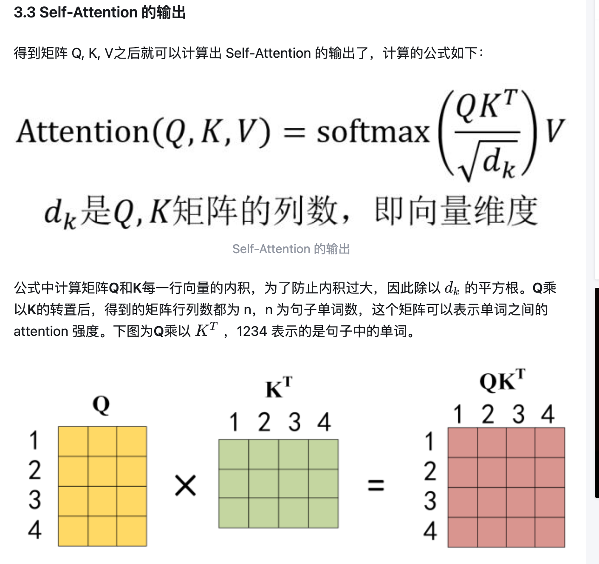

---

title: "0617 Transformer学习" # 标题，创建时自动填充
description: # 文章简介
date: 2025-06-17T10:54:53+08:00 # 日期，创建时自动填充，格式同 2023-01-15T12:00:00+08:00
image: # 文章的封面，留空就是没有，填文章所在位置的相对地址，通常放在同目录下，
math: # 是否启用 KaTex，填 true 启用
license: # 文章尾部显示的协议，false 为隐藏，其他作为内容，留空就是使用 config.yaml 里默认的
hidden: false # 是否隐藏，一般用不到
comments: true # 因为 bug 所以这个属性只要存在，不管是 true 还是 false 都会导致回复无法显示，需要删掉
draft: false # 是否为草稿，建议改为 false 或者删掉这个属性以防止忘记修改，毕竟我们一般都是写好了才部署到服务器上
tags:
categories: 技术
weight: 1 
---

第一遍看下来，感觉大部分是公式和矩阵计算之类的，transformer架构中每一个模块都有不同的计算公式和方法，给人看的懵懵的，不知道学习这个对AI的应用开发帮助是否大，只能说这块的学习是以了解一下，拓宽知识广度为目的。后面需要面试跳槽🐶，或者是工作中有对应需求的情况下再去深入理解。

transformer整体流程结构：

流程:

1.将输入句子中每一个单词的位置embedding和词embeeding相加，组成一个transformer表示矩阵进行输入

2.将transformor表示矩阵输入到多个encoder中，最终转换成编码矩阵

3.将编码矩阵输入到多个decoder中，decoder会按顺序+mask（遮盖住还未经过decoder的输入矩阵），一行一行的将每个单词进行预测。

transformer内部结构

上图是论文中 Transformer 的内部结构图，左侧为 Encoder block，右侧为 Decoder block。红色圈中的部分为 Multi-Head Attention，是由多个 Self-Attention组成的，可以看到 Encoder block 包含一个 Multi-Head Attention，而 Decoder block 包含两个 Multi-Head Attention (其中有一个用到 Masked)。Multi-Head Attention 上方还包括一个 Add & Norm 层，Add 表示残差连接 (Residual Connection) 用于防止网络退化，Norm 表示 Layer Normalization，用于对每一层的激活值进行归一化。

self-attention 结构

计算的的时候需要用到Q,K,V
本质上就是基于上面输入的transformer向量X做矩阵变换

得到Q,K,V之后用下面的公式进行计算

