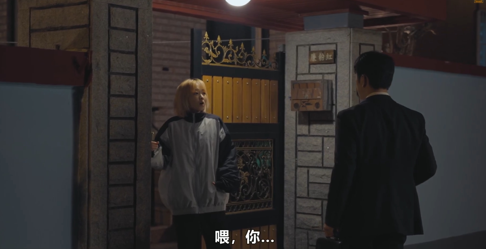

---

title: "0617 未知的首尔" # 标题，创建时自动填充
description: # 文章简介
date: 2025-06-17T15:15:48+08:00 # 日期，创建时自动填充，格式同 2023-01-15T12:00:00+08:00
image: # 文章的封面，留空就是没有，填文章所在位置的相对地址，通常放在同目录下，
math: # 是否启用 KaTex，填 true 启用
license: # 文章尾部显示的协议，false 为隐藏，其他作为内容，留空就是使用 config.yaml 里默认的
hidden: false # 是否隐藏，一般用不到
comments: true # 因为 bug 所以这个属性只要存在，不管是 true 还是 false 都会导致回复无法显示，需要删掉
draft: false # 是否为草稿，建议改为 false 或者删掉这个属性以防止忘记修改，毕竟我们一般都是写好了才部署到服务器上
tags:
categories: 书剧笔记
weight: 1 
---

未知和未来是一对双胞胎，一个在学习方面有天赋 另外一个在体育方面有天赋 未来考上了首尔大学。 未知则在体育高考中的跑步比赛里受伤了，梦想也破灭了。其实未知上不了大学之后也想去找工作，但是因为外婆重病住院，所以就一直照顾她，也因此放弃了自己的未来，天天干着零时工。未知则去了大城市上班，每个月将工资寄回家，压力也很大。

剧中未知曾有一段话，我会变成这样是因为我本来就是这样的人吗？还是因为我过的生活让我变成现在这样。 这句话还挺有意思的，我理解的话，其实两者都有吧。挺矛盾的也不太好说 我感觉还是生活对人的影响大吧，环境对一个人的影响会更大一点。 因为人刚出生下来，其实感觉很多东西都是不确定的。其实都是被环境所去影响去塑造的。

这里可以看出来，虽然未知特别有爱心，把自己的未来放弃了，而去照顾外婆，但我觉得在现实当中去。这种方法是不可取的。联想到现实，我也觉得就是说家里能帮的要帮，但是不应该让自己的未来被家庭所束缚，自己的方向还是要靠自己去掌握。不过，我顺便吐槽一句：看了这么多韩剧。每一个剧里面都有很多演员似曾相识的，特别脸熟😂。

还有一个男主男浩珠,浩珠学习成绩也很好，然后是未来跟位置的邻居高中的时候。 其实刚来的时候，他是也是挺高冷的。但是学习也挺好的跟未来一直是第一第二，高中的时候也在一起谈恋爱，但其实看起来其实浩朱好像是喜欢未知的，这个也不确定往后面慢慢看吧。

我早剧情真有意思吧我说实话。

第二集也好看哎，但是看到现在还是不清楚男主到底喜欢谁。但是中间穿插的一些回忆还挺有意思的，这种叙事方式我还比较喜欢，起码容易看懂，不像有些韩剧在前几集埋个伏笔，在最后一两集才回应一下，不看弹幕都不知道这是伏笔哈哈哈哈。另外这个剧情没啥问题，但是像我这种比较怕尴尬的人是真的看一会儿就得暂停一下hhh，但是女主男主确实都挺好看的哈哈哈哈，很难忍住不看下去。

自我中心这段是真的蚌埠住了，未知跟未来学的哈哈哈

快要看完第二集了第二集比较感动的一段是未来代替未知去看外婆的时候。 这一段外婆直接认出了未来，然后未来也袒露了自己的心声说自己工作压力太大了，决定放弃了 这个想法也得到了外婆的理解,还是挺感动的.